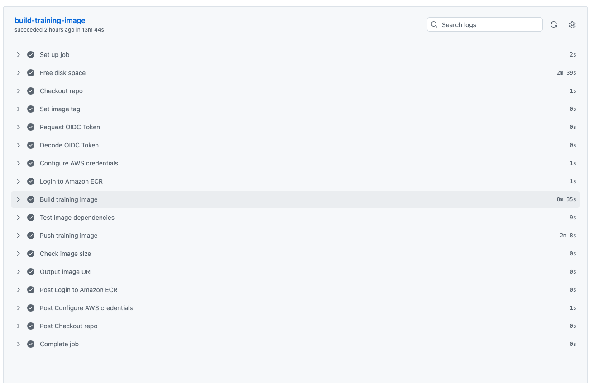
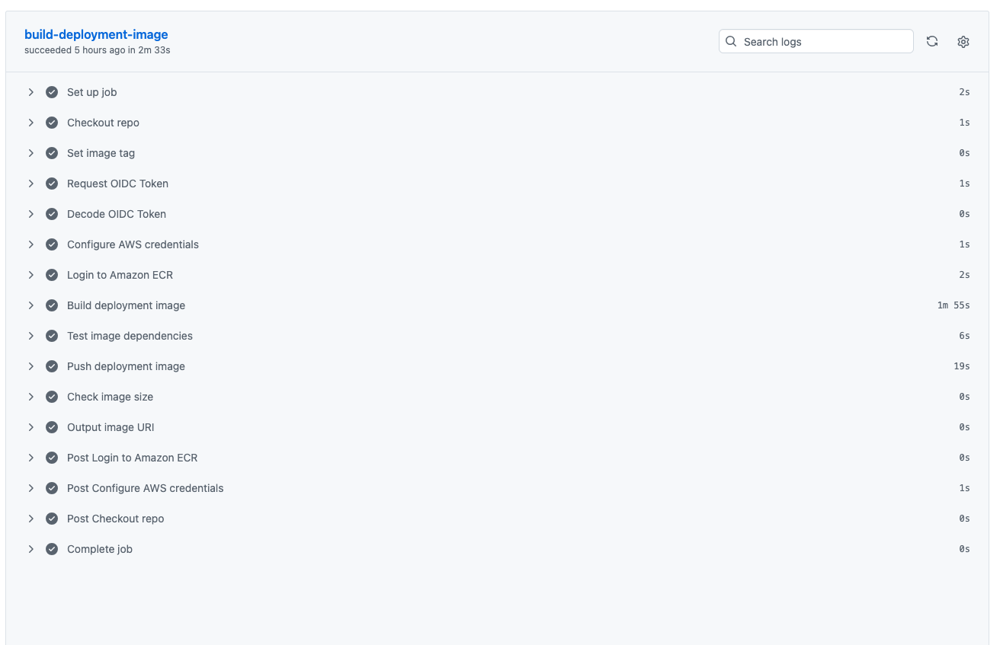
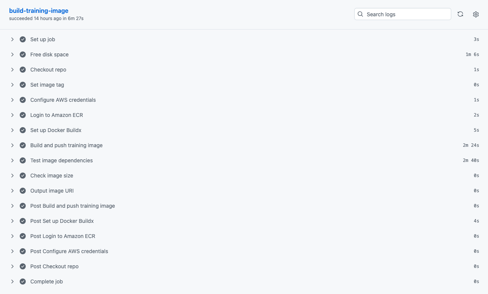
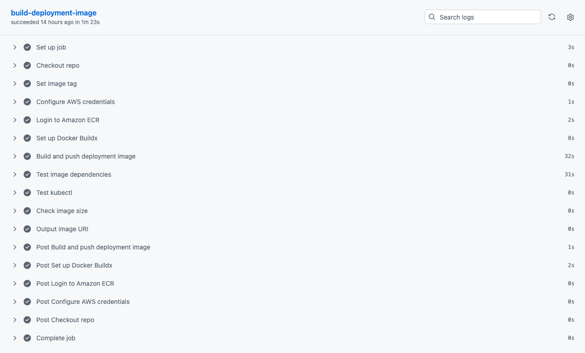

# GitHub Actions Workflows

CI/CD workflows for building and pushing Docker images to Amazon ECR. Each pipeline (Triton, MLServer, vLLM) has separate images for training and deployment.

## Workflows

| Workflow | Image | Dockerfile | Size |
|----------|-------|------------|------|
| `triton-build-training-image.yaml` | `triton-training-tools` | `docker/triton/Dockerfile.training` | ~3 GB (PyTorch) |
| `triton-build-deployment-image.yaml` | `mlops-deployment-tools` | `docker/triton/Dockerfile.deployment` | ~1 GB |
| `vllm-build-training-image.yaml` | `vllm-training-tools` | `docker/vllm/Dockerfile.training` | ~4 GB (PyTorch + transformers) |
| `vllm-build-deployment-image.yaml` | `vllm-deployment-tools` | `docker/vllm/Dockerfile.deployment` | ~400 MB |

All images are pushed to ECR: `123456789012.dkr.ecr.eu-central-1.amazonaws.com`

## Triggers

Workflows run automatically on:
- **Push to `main` or `develop`** — if relevant files changed (path filters)
- **Git tags** matching `v*` — for versioned releases
- **Manual dispatch** — with optional custom image tag

### Path Filters

| Workflow | Triggered by changes to |
|----------|------------------------|
| Triton training image | `training/triton/**`, `docker/triton/Dockerfile.training`, self |
| Triton deployment image | `deployment/triton/**`, `docker/triton/Dockerfile.deployment`, self |
| vLLM training image | `training/vllm/**`, `docker/vllm/Dockerfile.training`, self |
| vLLM deployment image | `deployment/vllm/**`, `evaluation/vllm/**`, `performance/vllm/**`, `docker/vllm/Dockerfile.deployment`, self |

### Tagging Strategy

| Trigger | Image Tag |
|---------|-----------|
| Push to `main` | `latest` |
| Push to `develop` | `develop-<short-sha>` |
| Git tag `v1.2.3` | `v1.2.3` |
| Manual with custom tag | custom value |
| Manual without tag | `latest` |

## Authentication: GitHub OIDC to AWS

The workflows use **OIDC federation** (no static AWS credentials):

```
GitHub Actions  --OIDC token-->  AWS STS  --assume role-->  ECR push
```

**Required setup:**
1. **GitHub secret** `AWS_ROLE_ARN` — the IAM role ARN to assume
2. **IAM trust policy** on the role must allow this repository:
   ```json
   {
     "Effect": "Allow",
     "Principal": {"Federated": "arn:aws:iam::<ACCOUNT>:oidc-provider/token.actions.githubusercontent.com"},
     "Action": "sts:AssumeRoleWithWebIdentity",
     "Condition": {
       "StringEquals": {
         "token.actions.githubusercontent.com:aud": "sts.amazonaws.com"
       },
       "StringLike": {
         "token.actions.githubusercontent.com:sub": "repo:<ORG>/<REPO>:*"
       }
     }
   }
   ```
3. **Permissions** in the workflow YAML:
   ```yaml
   permissions:
     id-token: write   # Request OIDC token
     contents: read     # Checkout repo
   ```

## Build Steps

Both workflows follow the same pattern:

1. **Free disk space** (training image only) — removes pre-installed software (~15 GB) to make room for PyTorch
2. **Checkout** repo
3. **Set image tag** based on trigger type
4. **OIDC authentication** — request token, assume AWS role
5. **ECR login**
6. **Build** Docker image
7. **Test** — runs `python -c "import ..."` to verify all dependencies are importable
8. **Push** to ECR
9. **Size check** — warns if image exceeds threshold (3 GB for training, 1 GB for deployment)

### Successful Runs

#### Triton

**Training image** — 13m 44s (build step: 8m 35s due to PyTorch):



**Deployment image** — 2m 33s (build step: 1m 55s, no PyTorch):



#### vLLM

**Training image** — 6m 27s (build step: 2m 24s):



**Deployment image** — 1m 23s (build step: 32s, no PyTorch):



### Disk Space Workaround

The training image contains PyTorch (~2 GB) which makes the total image ~3 GB. GitHub Actions runners have ~14 GB total disk, which isn't enough after pre-installed tools. The "Free disk space" step removes:

| Removed | Space freed |
|---------|-------------|
| .NET SDK (`/usr/share/dotnet`) | ~2 GB |
| Android SDK (`/usr/local/lib/android`) | ~7 GB |
| GHC (`/opt/ghc`) | ~3 GB |
| CodeQL (`/opt/hostedtoolcache/CodeQL`) | ~1 GB |
| Unused Docker images | ~2 GB |

This frees ~15 GB, enough to build and export the PyTorch image. The deployment image doesn't need this step because it's much smaller (no PyTorch).

## Docker Images

### triton-training-tools

Used by the [Training Workflow](../../workflows/triton/README.md). Contains everything needed to train, promote, export, and validate models.

| Layer | Dependencies |
|-------|-------------|
| Base | `python:3.11-slim` |
| System | curl, unzip, jq, libgomp1 |
| PyTorch | torch, torchvision |
| ML tools | mlflow, onnx, onnxruntime, onnxscript, numpy, pyyaml, boto3 |
| AWS CLI | v2 (for `aws s3 sync` dataset download) |
| Scripts | `training/triton/` copied to `/scripts/` |

### mlops-deployment-tools

Used by the [Triton Deployment Workflow](../../workflows/triton/README.md). Lightweight image without PyTorch.

| Layer | Dependencies |
|-------|-------------|
| Base | `python:3.11-slim` |
| System | curl, unzip, jq, libgomp1 |
| ML tools | mlflow, onnx, onnxruntime, numpy, boto3, requests |
| AWS CLI | v2 |
| Scripts | `deployment/triton/` copied to `/scripts/` |

### vllm-training-tools

Used by the [vLLM Training Workflow](../../workflows/vllm/README.md). Contains everything needed for QLoRA fine-tuning.

| Layer | Dependencies |
|-------|-------------|
| Base | `python:3.11-slim` |
| System | curl, unzip, jq |
| PyTorch | torch |
| ML tools | transformers, peft, bitsandbytes, trl, datasets, mlflow, boto3 |
| AWS CLI | v2 |
| Scripts | `training/vllm/` copied to `/scripts/` |

### vllm-deployment-tools

Used by the [vLLM Deployment, Evaluation, Performance, and Promote Workflows](../../workflows/vllm/README.md) and as init-container for the vLLM pod. Lightweight image without PyTorch.

| Layer | Dependencies |
|-------|-------------|
| Base | `python:3.11-slim` |
| System | curl, unzip, jq, kubectl |
| ML tools | mlflow, boto3, requests |
| AWS CLI | v2 |
| Scripts | `deployment/vllm/` → `/scripts/`, `evaluation/vllm/` → `/eval-scripts/`, `performance/vllm/` → `/perf-scripts/` |

## Manual Trigger

```bash
# Build with default tag
gh workflow run "Build Triton Training Image" --ref main

# Build with custom tag
gh workflow run "Build Triton Training Image" --ref main -f tag=v2.0.0
```
