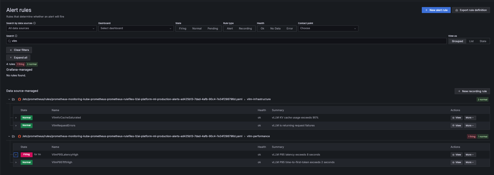
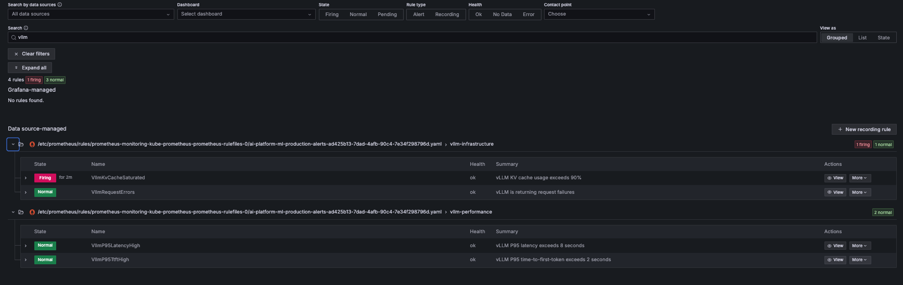
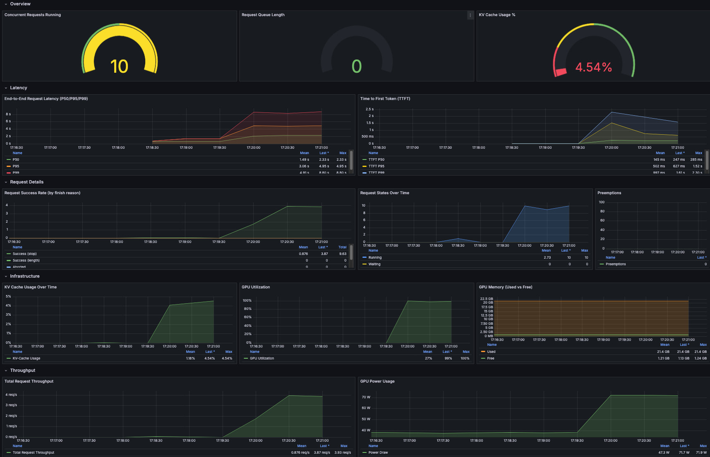

# Production Monitoring & Alerting

Grafana dashboards and Prometheus alert rules for vLLM and Triton inference services. Alerts fire when performance degrades or infrastructure limits are reached.

## Architecture

```
Git (declarative manifests)
├── PrometheusRule CRD         → 6 alert rules (ArgoCD auto-sync)
├── Dashboard ConfigMaps       → Grafana sidecar (ArgoCD auto-sync)
└── ServiceMonitor CRDs        → Prometheus scraping (ArgoCD auto-sync)
        │
        v
Kubernetes (ai-platform namespace)
        │
        ├── Prometheus ← evaluates PrometheusRule every 30s
        │       │
        │       v
        │   AlertManager ← routes alerts to receivers
        │
        └── Grafana
            ├── Dashboard: vLLM Production    ← ConfigMap sidecar
            ├── Dashboard: Triton Production  ← ConfigMap sidecar
            └── Alerting > Datasource-managed ← shows PrometheusRule alerts
                    │
                    v
            Prometheus (ai-platform)
            ├── vLLM metrics    ← ServiceMonitor (infra/k8s/vllm/base/)
            └── Triton metrics  ← ServiceMonitor (infra/k8s/triton/base/)
```

Alert rules and dashboards are declarative (YAML in Git, ArgoCD auto-sync). AlertManager routing (e.g., Slack, PagerDuty) is configured separately via the kube-prometheus-stack Helm values.

## Monitoring Layers

This implementation covers **service-level monitoring** — technical metrics exposed by the inference servers themselves:

| Layer | What | How | This Repo |
|-------|------|-----|-----------|
| **Infrastructure** | Node CPU/memory, GPU, disk | Prometheus (node-exporter, DCGM) | Dashboards + alerts |
| **Service** | Latency, throughput, errors, cache | Prometheus (vLLM/Triton metrics) | Dashboards + alerts |
| **Application** | Refusal rate, response quality, coverage gaps | Structured logs (Loki/ELK) | Stage 2 (see below) |

## Alert Rules

Defined as a `PrometheusRule` CRD (`infra/k8s/monitoring/alerts/prometheusrule.yaml`). Prometheus evaluates these rules continuously. When a condition is met for the specified duration, the alert fires. Alert state is visible in both Prometheus and Grafana.

| Alert | Category | Condition | Duration | Severity |
|-------|----------|-----------|----------|----------|
| VllmP95LatencyHigh | Performance | P95 e2e latency > 8s | 2 min | critical |
| VllmP95TtftHigh | Performance | P95 time-to-first-token > 2s | 2 min | warning |
| VllmKvCacheSaturated | Infrastructure | KV cache usage > 90% | 5 min | warning |
| VllmRequestErrors | Infrastructure | Any request failures | 2 min | critical |
| TritonInferenceErrors | Infrastructure | Any inference failures | 2 min | critical |
| TritonQueueSaturation | Performance | Avg queue wait > 1s | 3 min | warning |

Each alert includes `summary`, `description`, and `runbook` annotations for quick diagnosis.

### Viewing Alerts in Grafana

PrometheusRule-based alerts appear in Grafana under **Alerting > Alert rules** in the "Datasource-managed" section. Grafana queries the Prometheus API (`/api/v1/rules`) to display rule state (firing/pending/inactive), labels, and annotations.

### Verified: Alerts Firing Under Load

Both alert types have been verified on a live cluster (single NVIDIA L4 GPU, LoRA adapter `aws-rag-qa-live`). The screenshots below show alerts transitioning to "Firing" state during a load test.

**VllmP95LatencyHigh** — fired when P95 latency exceeded the threshold under sustained concurrent load:



**VllmKvCacheSaturated** — fired when KV cache usage exceeded the threshold during the performance test (threshold was lowered to 2% for demonstration, since the single-GPU setup only reaches ~4% KV cache utilization under load):



**Dashboard during load test** — showing latency spikes, GPU saturation, and KV cache usage:



> **Note on thresholds:** The production thresholds (8s latency, 90% KV cache) are designed for real-world degradation scenarios. On a single L4 GPU with a small LoRA adapter, the system performs well even under heavy load. For demonstration purposes, the KV cache threshold was temporarily lowered to verify the complete alert pipeline (PrometheusRule > Prometheus > Grafana).

## Dashboards

Provisioned as ConfigMaps with label `grafana_dashboard: "1"` (`infra/k8s/monitoring/grafana/`). The kube-prometheus-stack Grafana sidecar auto-loads them.

### vLLM Production

Based on the existing cluster dashboard, enhanced with row separators and a datasource template variable.

- **Overview:** Concurrent requests (gauge), queue length (gauge), KV cache % (gauge)
- **Latency:** P50/P95/P99 end-to-end latency (fixed colors: green/orange/red), P50/P95/P99 TTFT
- **Request Details:** Success rate by finish reason (stop/length/abort/error), request states (running/waiting), preemptions
- **Infrastructure:** KV cache over time, GPU utilization, GPU memory (used vs free)
- **Throughput:** Total request throughput, GPU power usage

### Triton Production

- **Inference:** Request rate (success/failure per model), inference latency, total count
- **Queue:** Queue duration, compute duration
- **Infrastructure:** GPU utilization, GPU memory, GPU power

### Maintaining Dashboards

1. Edit in Grafana UI (with live data)
2. Export: `curl -s -u admin:<pw> http://localhost:3000/api/dashboards/uid/<uid> | jq '.dashboard'`
3. Paste JSON into the ConfigMap
4. Git push → ArgoCD sync → sidecar reloads

The ConfigMap is the source of truth. Local Grafana changes are overwritten on sync.

## Setup

### 1. Deploy via ArgoCD

| Application | Path | What |
|-------------|------|------|
| `grafana-dashboards` | `infra/k8s/monitoring/grafana/` | Dashboard ConfigMaps → ai-platform |
| `ml-alerts` | `infra/k8s/monitoring/alerts/` | PrometheusRule → ai-platform |
| `triton-inference-cpu` | `infra/k8s/triton/base/` | Includes ServiceMonitor → ml-models |

```bash
# Apply ArgoCD apps (if not yet registered)
kubectl apply -f infra/argocd/monitoring/grafana-dashboards.yaml
kubectl apply -f infra/argocd/monitoring/ml-alerts.yaml
```

### 2. Verify

```bash
# Check PrometheusRule is picked up
kubectl get prometheusrules -n ai-platform
# → ml-production-alerts

# Check alert rules in Prometheus
kubectl port-forward svc/monitoring-kube-prometheus-prometheus 9090:9090 -n ai-platform
# Open http://localhost:9090/rules — look for "vllm-performance", "vllm-infrastructure", "triton-alerts"

# Check dashboards in Grafana
kubectl port-forward svc/monitoring-grafana 3000:80 -n ai-platform
# Open http://localhost:3000 — both dashboards should appear

# Check alert state in Grafana
# Open Alerting → Alert rules → look for "Datasource-managed" section
```

## Simulating Alerts

Simulation scripts run as K8s Jobs inside the cluster network. This measures actual vLLM latency (not kubectl port-forward tunnel overhead).

### Setup

Apply the scripts ConfigMap once:

```bash
kubectl apply -f monitoring/jobs/scripts-configmap.yaml
```

### Latency Spike

Floods vLLM with concurrent requests. P95 latency and TTFT will spike, triggering alerts after the 2-minute threshold.

```bash
# Run simulation (50 concurrent requests, 3 minutes)
kubectl apply -f monitoring/jobs/simulate-latency-job.yaml

# Monitor progress
kubectl logs -f job/simulate-latency -n ml-models

# Cleanup before re-running
kubectl delete job simulate-latency -n ml-models
```

Default parameters (override by editing the Job env vars):

| Env Var | Default | Description |
|---------|---------|-------------|
| `CONCURRENCY` | 50 | Concurrent requests |
| `DURATION` | 180 | Duration in seconds |
| `MAX_TOKENS` | 2048 | Max tokens per request |
| `MODEL` | aws-rag-qa-live | Model/adapter name |

**Expected:** P95 Latency panel spikes > 8s → `VllmP95LatencyHigh` fires in Grafana Alerting.

### KV Cache Saturation

Sends requests with very long contexts (near `max_model_len=4096`).

```bash
# Run simulation (10 long-context requests, 5 concurrent)
kubectl apply -f monitoring/jobs/simulate-kv-cache-job.yaml

# Monitor progress
kubectl logs -f job/simulate-kv-cache -n ml-models

# Cleanup before re-running
kubectl delete job simulate-kv-cache -n ml-models
```

Default parameters (override by editing the Job env vars):

| Env Var | Default | Description |
|---------|---------|-------------|
| `NUM_REQUESTS` | 10 | Number of long-context requests |
| `CONTEXT_TOKENS` | 3000 | Approximate context length in tokens |
| `CONCURRENCY` | 5 | Concurrent requests |
| `MODEL` | aws-rag-qa-live | Model/adapter name |

**Expected:** KV Cache panel spikes > 90% → `VllmKvCacheSaturated` fires after 5 min in Grafana Alerting.

### Local Alternative

The scripts can also run locally via port-forward (e.g., for development):

```bash
kubectl port-forward svc/vllm-service 8000:8000 -n ml-models
python monitoring/scripts/simulate_latency.py --vllm-url http://localhost:8000
python monitoring/scripts/simulate_kv_cache.py --vllm-url http://localhost:8000
```

Note: Local execution measures port-forward tunnel latency, not actual vLLM latency.

## Stage 2: Application-Level Monitoring (Future)

Service-level metrics (latency, throughput, errors) tell you *how* the system is performing. They don't tell you *what* the system is saying. Application-level signals like refusal rate, response quality, or coverage gaps require a different approach.

### Why Not Prometheus?

Prometheus measures technical signals — counters, histograms, gauges. It doesn't see response content. Only the application layer (e.g., a chatbot, API gateway, or RAG pipeline) knows whether a response was a refusal, whether the answer was correct, or whether the user's question was out of domain.

### The Path: Structured Logging + Loki

```
Application (chatbot, API gateway)
    │
    │  Structured log: {"event": "response", "model": "aws-rag-qa-live",
    │                    "refusal": true, "latency_ms": 2340}
    v
Loki (log aggregation)
    │
    v
Grafana (LogQL queries + alerts)
    │
    │  LogQL: sum(count_over_time({app="chatbot"} | json | refusal="true" [5m]))
    │         / sum(count_over_time({app="chatbot"} | json [5m]))
    v
Alert: Refusal rate > 20% for 5 minutes → AlertManager
```

This approach requires:
1. **Loki** installed in the cluster (Helm chart: `grafana/loki-stack`)
2. **Applications** emitting structured JSON logs with semantic fields
3. **Grafana** data source for Loki alongside Prometheus

The dashboard can combine both data sources — Prometheus panels for infrastructure, Loki panels for application-level signals — in a single view.

### Why Stage 2?

This repo doesn't include a running application (chatbot). Without a real application emitting structured logs, adding Loki would be artificial. Stage 1 demonstrates production monitoring with the tools that are already in place. Stage 2 follows naturally when an application layer exists.
