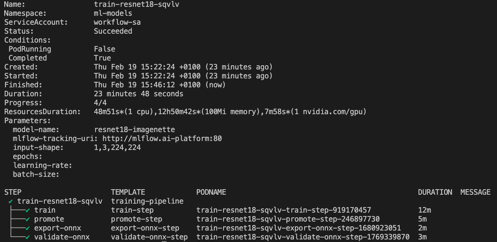
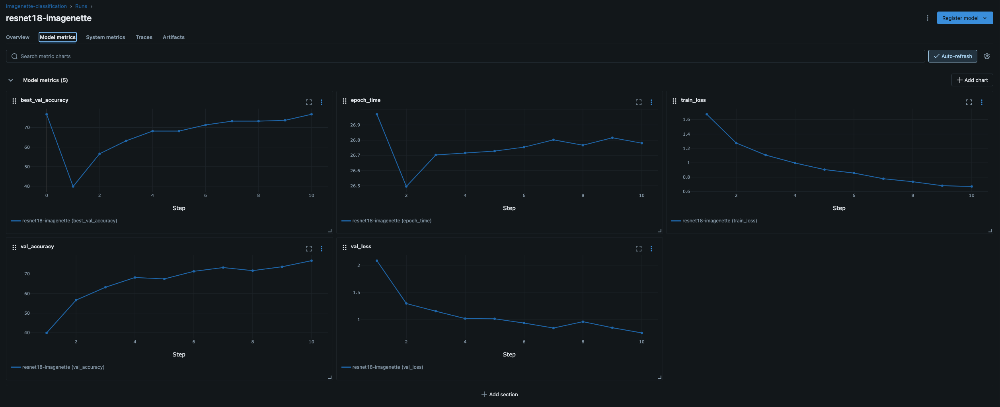
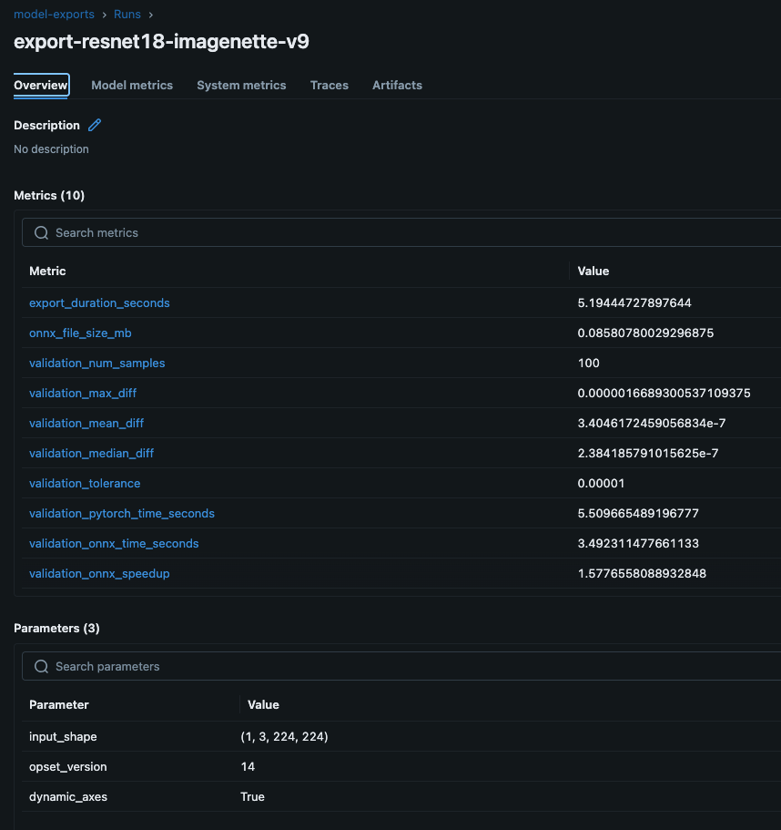
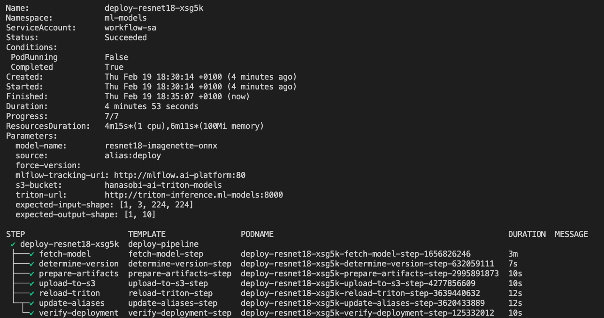
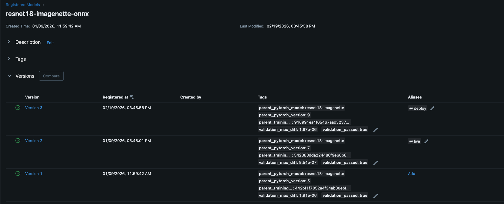

# Triton Argo Workflows

Argo Workflows for the Triton Inference Server ML pipeline. The pipeline is split into two independent workflows: **Training** (model creation) and **Deployment** (model serving).

## Overview

```
Training Workflow                          Deployment Workflow
==================                         ===================

train (GPU)                                fetch-model
    |                                          |
    v                                          v
promote (Gate 1)                           determine-version
    |                                          |
    | RESULT=passed?                           v
    |   no --> STOP                        prepare-artifacts
    |   yes                                    |
    v                                          v
export-onnx                                upload-to-s3
    |                                          |
    v                                          v
validate-onnx (Gate 2)                     reload-triton
                                               |
                                               v
                                        update-aliases + verify-deployment
```

The two workflows are connected through **MLflow Model Registry**:
- Training sets the `deploy` alias on a validated ONNX model
- Deployment reads the model with `alias:deploy`

## Training Workflow

**File:** `train-model-image-classification.yaml`

**Purpose:** Train a ResNet18 model on ImageNette, promote if it beats the current champion, export to ONNX, and validate the export.

### Steps

| Step | Script | Gate | Description |
|------|--------|------|-------------|
| train | `train.py` | - | Trains ResNet18 on ImageNette (runs on GPU) |
| promote | `promote.py` | Gate 1 | Compares candidate with champion. Sets `champion` alias if better |
| export-onnx | `export_to_onnx.py` | - | Converts PyTorch champion to ONNX format |
| validate-onnx | `validate_onnx.py` | Gate 2 | Numerical validation (PyTorch vs ONNX). Sets `deploy` alias if valid |

### Quality Gates

- **Gate 1 (Training Performance):** The candidate model must meet the absolute threshold (`best_val_accuracy >= 0.90`) AND show minimum improvement over the current champion (`+0.5%`). If the gate fails, the workflow ends gracefully — no ONNX export is attempted.
- **Gate 2 (Technical Correctness):** 100 random input samples are run through both PyTorch and ONNX models. The outputs must match within tolerance (`1e-5`). Only on success is the ONNX model registered with the `deploy` alias.

### Data Flow

Steps exchange only small identifiers (~32 bytes each) via Argo output parameters. All model artifacts stay in MLflow:

```
train ──run-id──> promote ──result──> export-onnx ──export-run-id──> validate-onnx
        (UUID)          (passed/       (UUID)
                         failed)
```

### Completed Training Workflow



All 4 steps completed successfully in ~24 minutes. The `train` step runs on a dedicated GPU node (g4dn.xlarge with NVIDIA T4), while `promote`, `export-onnx`, and `validate-onnx` run on standard CPU nodes.

### Training Metrics in MLflow



MLflow automatically tracks all training metrics per epoch: `best_val_accuracy`, `val_accuracy`, `val_loss`, `train_loss`, and `epoch_time`. These metrics are used by Gate 1 (promote step) to decide whether the candidate model should become the new champion.

### ONNX Export and Validation Metrics



The export run logs validation metrics from Gate 2: `validation_max_diff` and `validation_mean_diff` show numerical equivalence between PyTorch and ONNX outputs. The `validation_onnx_speedup` shows the inference speedup from ONNX Runtime compared to PyTorch.

### Parameters

| Parameter | Default | Description |
|-----------|---------|-------------|
| `model-name` | `resnet18-imagenette` | Model name in MLflow Registry |
| `mlflow-tracking-uri` | `http://mlflow.ai-platform:80` | MLflow server URL |
| `input-shape` | `1,3,224,224` | Input shape for ONNX export |
| `epochs` | _(from config.yaml)_ | Override training epochs |
| `learning-rate` | _(from config.yaml)_ | Override learning rate |
| `batch-size` | _(from config.yaml)_ | Override batch size |

### Resource Requirements

| Step | Node | GPU | CPU | Memory |
|------|------|-----|-----|--------|
| train | `gpu-training` (g4dn.xlarge) | 1x T4 | 3-4 | 8-14Gi |
| promote | any | - | 250m-500m | 512Mi-1Gi |
| export-onnx | any | - | 1-2 | 2-4Gi |
| validate-onnx | any | - | 1-2 | 2-4Gi |

### Usage

```bash
# Default training run
argo submit train-model-image-classification.yaml

# Override hyperparameters
argo submit train-model-image-classification.yaml \
  -p epochs=20 \
  -p learning-rate=0.0005 \
  -p batch-size=32
```

## Deployment Workflow

**File:** `deploy-model-image-classification.yaml`

**Purpose:** Deploy a validated ONNX model from MLflow to Triton Inference Server via S3.

### Steps

| Step | Script | Description |
|------|--------|-------------|
| fetch-model | `fetch_model.py` | Downloads ONNX model from MLflow (`alias:deploy`) |
| determine-version | `determine_version.py` | Scans S3 for existing versions, calculates next |
| prepare-artifacts | `prepare_artifacts.py` | Creates metadata.json with MLflow/Triton info |
| upload-to-s3 | `upload_to_s3.py` | Uploads to S3 using staging pattern (atomic) |
| reload-triton | `reload_triton.py` | Refreshes Triton repo, loads model, waits for ready |
| update-aliases | `update_aliases.py` | Moves `live` alias to new version, old to `previous` |
| verify-deployment | `verify_deployment.py` | Functional test with synthetic input |

Steps 6 and 7 (update-aliases + verify-deployment) run in parallel.

### Data Flow

Unlike the training workflow, deployment passes actual model files between steps using Argo Artifacts (S3-backed):

```
fetch-model ──model.onnx──> prepare-artifacts ──artifacts/──> upload-to-s3
            ──metadata.json──>                                     |
                                                                   v
determine-version ──triton_version.txt──────────────────> reload-triton
                                                                   |
                                                                   v
                                                     update-aliases + verify
```

### Completed Deployment Workflow



All 7 steps completed in under 5 minutes. The workflow fetches the model from MLflow, determines the next Triton version number, uploads to S3, reloads Triton, updates MLflow aliases, and verifies the deployment with a functional test — all without manual intervention.

### Deployment Metadata

Each deployment produces a `metadata.json` that is stored alongside the model in S3, providing full traceability:

```json
{
  "mlflow": {
    "model_name": "resnet18-imagenette-onnx",
    "version": "4",
    "run_id": "85f60b2e526d4c5987795354e7335be6",
    "alias_at_deploy": "alias:deploy",
    "run_name": "export-resnet18-imagenette-v10"
  },
  "triton": {
    "version": "3",
    "deployed_at": "2026-02-19T17:33:50.793742+00:00",
    "deployed_by": "deploy-resnet18-xsg5k-prepare-artifacts-step-2995891873"
  },
  "model": {
    "format": "onnx",
    "file_size_mb": 42.72,
    "inputs": [{"name": "input", "shape": ["batch_size", 3, 224, 224]}],
    "outputs": [{"name": "output", "shape": ["batch_size", 10]}]
  },
  "validation": {
    "validation_max_diff": 1.43e-06,
    "validation_onnx_speedup": 1.49
  }
}
```

### Parameters

| Parameter | Default | Description |
|-----------|---------|-------------|
| `model-name` | `resnet18-imagenette-onnx` | ONNX model name in MLflow |
| `source` | `alias:deploy` | Which model version to deploy |
| `force-version` | _(empty)_ | Force a specific Triton version |
| `mlflow-tracking-uri` | `http://mlflow.ai-platform:80` | MLflow server URL |
| `s3-bucket` | `my-triton-models` | S3 bucket for Triton model repo |
| `triton-url` | `http://triton-inference.ml-models:8000` | Triton server URL |
| `expected-input-shape` | `[1, 3, 224, 224]` | For verification step |
| `expected-output-shape` | `[1, 10]` | For verification step |

### Usage

```bash
# Deploy latest model with 'deploy' alias
argo submit deploy-model-image-classification.yaml

# Deploy a specific version
argo submit deploy-model-image-classification.yaml \
  -p source="version:5"
```

## MLflow Alias Strategy

```
Training Pipeline          Deployment Pipeline          Production
=================          ====================         ==========

train
  |
  v
promote ──champion──>  (best trained model)
  |
  v
export
  |
  v
validate ──deploy──>  fetch-model
                         |
                         v
                       upload + reload
                         |
                         v
                       update-aliases ──live──>  (serving traffic)
                                     ──previous──>  (rollback target)
```

| Alias | Set By | Meaning |
|-------|--------|---------|
| `champion` | promote.py | Best trained PyTorch model (training metric) |
| `deploy` | validate_onnx.py | Technically validated ONNX model (ready for deployment) |
| `live` | update_aliases.py | Currently serving in Triton |
| `previous` | update_aliases.py | Rollback target (was `live` before latest deployment) |

### MLflow Model Registry



The Model Registry shows the alias strategy in action: Version 3 carries the `deploy` alias (ready for deployment), Version 2 is `live` (currently serving). Each version has traceability tags linking back to the parent PyTorch model and training run.

## Docker Images

| Image | Used By | Key Dependencies |
|-------|---------|------------------|
| `triton-training-tools` | Training Workflow | PyTorch, torchvision, MLflow, ONNX, onnxruntime |
| `mlops-deployment-tools` | Deployment Workflow | MLflow, boto3, ONNX, requests |

Both images are built via GitHub Actions and pushed to ECR (`123456789012.dkr.ecr.eu-central-1.amazonaws.com`).

## Prerequisites

- Argo Workflows controller installed in the cluster
- `workflow-sa` ServiceAccount with IRSA annotation for AWS S3 access
- MLflow Tracking Server accessible at the configured URI
- For training: `gpu-training` node group with `nvidia.com/gpu` taint
- For deployment: Triton Inference Server running with EXPLICIT model control mode
