# vLLM Argo Workflows

Argo Workflows for the vLLM LoRA adapter pipeline. Five independent workflows: **Training** (adapter creation), **Deployment** (adapter loading), **Evaluation** (Gate 1: LLM-as-Judge), **Performance** (Gate 2: load test), and **Promote** (production deployment).

## Overview

```
Training         Deployment         Evaluation (Gate 1)    Performance (Gate 2)   Promote
==========       ============       ===================    ====================   =======

download-data    load-adapter       download-eval-data     download-eval-data     promote-adapter
    |                |                   |                      |                      |
    v                v                   v                      v                      v
train (GPU)      smoke-test         inference-cand ─┐      run-load-test          (live + previous
    |                |              inference-live ──┤          |                   aliases set,
    v                v                   |          |          v                   gates cleaned)
quality-gate     set-staged-alias    judge-answers  |      perf-decision
    |                                    |          |          |
    | passed?                            v          |          | passed?
    |   no -> STOP                   compare-decision          |   no -> STOP
    |   yes -> 'candidate'               |                     |   yes -> 'perf-passed'
                                         | passed?
                                         |   no -> STOP
                                         |   yes -> 'eval-passed'
```

The five workflows are connected through **MLflow Model Registry**:
- Training sets the `candidate` alias on a validated adapter
- Deployment reads the adapter with `alias:candidate`, sets `staged` after smoke test
- Evaluation reads the `staged` adapter, compares against `live`, sets `eval-passed` or `eval-failed`
- Performance reads eval data via `eval-passed` alias, runs load test, sets `perf-passed` or `perf-failed`
- Promote reads from a configurable alias (default: `staged`, use `perf-passed` after full pipeline), promotes to `live`

## Training Workflow

**File:** `train-validate-lora.yaml`

**Purpose:** Fine-tune Mistral-7B with QLoRA, validate training metrics, and register the adapter as a candidate for deployment.

### Steps

| Step | Script | Gate | Description |
|------|--------|------|-------------|
| download-data | `aws s3 sync` | - | Downloads training data from S3 |
| train | `train_lora.py` | - | QLoRA fine-tuning on GPU (Mistral-7B) |
| quality-gate | `quality_gate.py` | Gate 1 | Checks eval_loss + perplexity. Sets `candidate` alias if passed |

### Quality Gate

The quality gate checks two metrics against configurable thresholds:
- **eval_loss** <= 1.0 (default)
- **perplexity** <= 2.0 (default)

If the gate fails, the workflow ends gracefully. The adapter is not registered in the Model Registry.

### Data Flow

Steps exchange only small identifiers via Argo output parameters. Training data is passed as an Argo artifact, adapter files stay in MLflow:

```
download-data ──data/──> train ──run-id──> quality-gate
                          (UUID)            (passed/failed)
```

### Parameters

| Parameter | Default | Description |
|-----------|---------|-------------|
| `data-version` | `1` | Training data version (S3 prefix) |
| `lora-config` | `standard` | LoRA configuration profile: `minimal`, `standard`, `aggressive`, `high_capacity` |
| `mlflow-tracking-uri` | `http://mlflow.ai-platform:80` | MLflow server URL |
| `s3-data-bucket` | `s3://my-vllm-data` | S3 bucket for training data |
| `learning-rate` | _(from config.py)_ | Override learning rate |
| `num-epochs` | _(from config.py)_ | Override training epochs |
| `batch-size` | _(from config.py)_ | Override batch size |
| `max-seq-length` | _(from config.py)_ | Override max sequence length |
| `max-eval-loss` | _(from config.py)_ | Override quality gate threshold |
| `max-perplexity` | _(from config.py)_ | Override quality gate threshold |

### Resource Requirements

| Step | Node | GPU | CPU | Memory |
|------|------|-----|-----|--------|
| download-data | any | - | 250m-500m | 256Mi-512Mi |
| train | `gpu-training` (g5.xlarge) | 1x L4 | 3-4 | 12-14Gi |
| quality-gate | any | - | 250m-500m | 512Mi-1Gi |

### Usage

```bash
# Default training run
argo submit train-validate-lora.yaml

# Override hyperparameters
argo submit train-validate-lora.yaml \
  -p num-epochs=5 \
  -p learning-rate=1e-4 \
  -p lora-config=extended

# Override quality gate thresholds
argo submit train-validate-lora.yaml \
  -p max-eval-loss=0.8 \
  -p max-perplexity=3.0
```

### Successful Runs

Two adapters trained in parallel on separate GPU nodes (different datasets, same LoRA config):


Completed training workflow (data-version=1, 4h19m total — download 1m, train 4h, quality gate 2m):

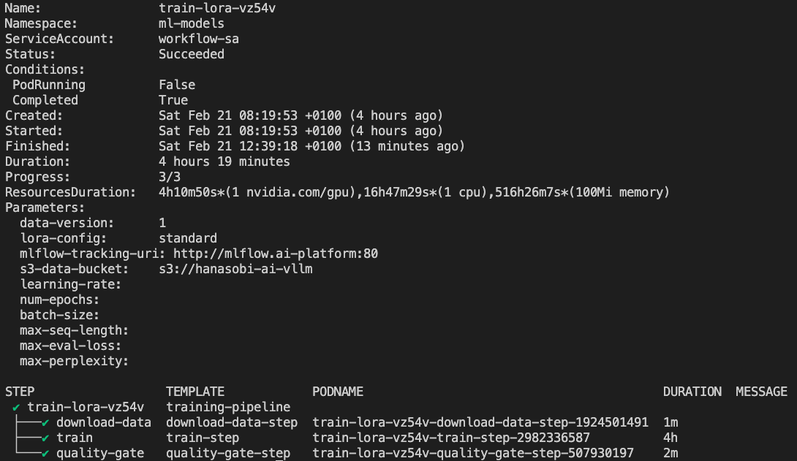

Both runs completed with metrics and registered model versions:

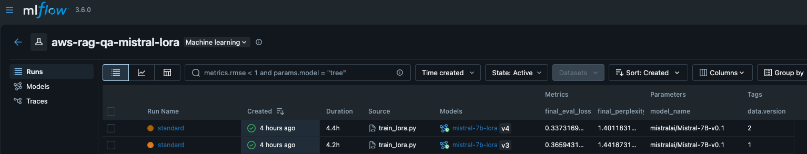

MLflow model metrics dashboard (eval_loss converging, train_loss decreasing):

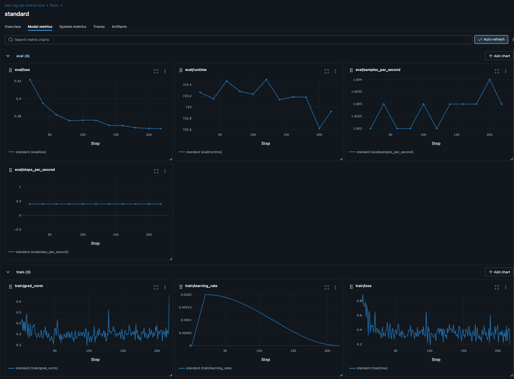

Model Registry after training — v3 has `live` alias, v4 has `candidate`:

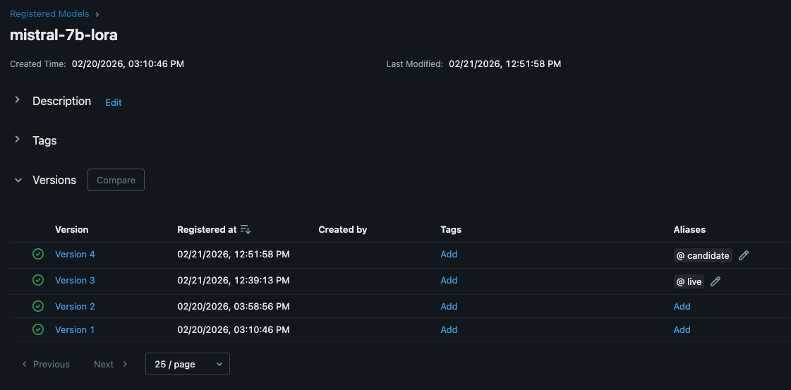

## Deployment Workflow

**File:** `deploy-lora-adapter.yaml`

**Purpose:** Load a candidate LoRA adapter from MLflow into the running vLLM server via runtime API, run smoke tests, and mark as staged.

### Steps

| Step | Script | Description |
|------|--------|-------------|
| load-adapter | `load_adapter.py` | Download from MLflow, `kubectl cp` to pod, load via API |
| smoke-test | `smoke_test.py` | Send test inference requests, validate responses |
| set-staged-alias | `set_staged_alias.py` | Set `staged` alias in MLflow |

### Runtime Loading (No Restart)

The deployment workflow uses the vLLM runtime LoRA API instead of restarting the pod:

```
MLflow ──download──> Workflow Pod ──kubectl cp──> vLLM Pod ──API load──> Ready
```

This takes seconds instead of 8+ minutes (full pod restart with GPU re-initialization).

**Requirements:**
- `VLLM_ALLOW_RUNTIME_LORA_UPDATING=True` on the vLLM server
- `workflow-sa` ServiceAccount with RBAC for `pods/exec` and `kubectl cp`

### Data Flow

The load-adapter step downloads from MLflow directly and copies to the vLLM pod. No S3 staging bucket needed:

```
load-adapter ──status──> smoke-test ──status──> set-staged-alias
  (MLflow → pod → API)   (inference test)       (MLflow alias)
```

### Parameters

| Parameter | Default | Description |
|-----------|---------|-------------|
| `model-name` | `mistral-7b-lora` | MLflow registered model name |
| `adapter-source` | `alias:candidate` | Which adapter version to deploy |
| `slot-name` | `aws-rag-qa-candidate` | Target adapter slot on vLLM |
| `vllm-url` | `http://vllm-service.ml-models:8000` | vLLM server URL |
| `mlflow-tracking-uri` | `http://mlflow.ai-platform:80` | MLflow server URL |

### Resource Requirements

| Step | Node | GPU | CPU | Memory |
|------|------|-----|-----|--------|
| load-adapter | any | - | 250m-500m | 512Mi-1Gi |
| smoke-test | any | - | 250m-500m | 256Mi-512Mi |
| set-staged-alias | any | - | 250m-500m | 256Mi-512Mi |

### Usage

```bash
# Deploy latest candidate
argo submit deploy-lora-adapter.yaml

# Deploy a specific version
argo submit deploy-lora-adapter.yaml \
  -p adapter-source="version:5"
```

### Successful Run

Deployment workflow completed in 3m 25s (load-adapter 2m, smoke-test 7s, set-staged-alias 10s):

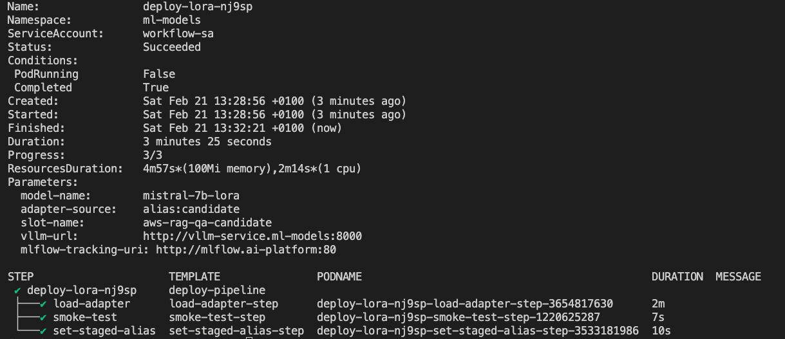

Smoke test passing 3/3 — all responses valid, average latency 0.74s:

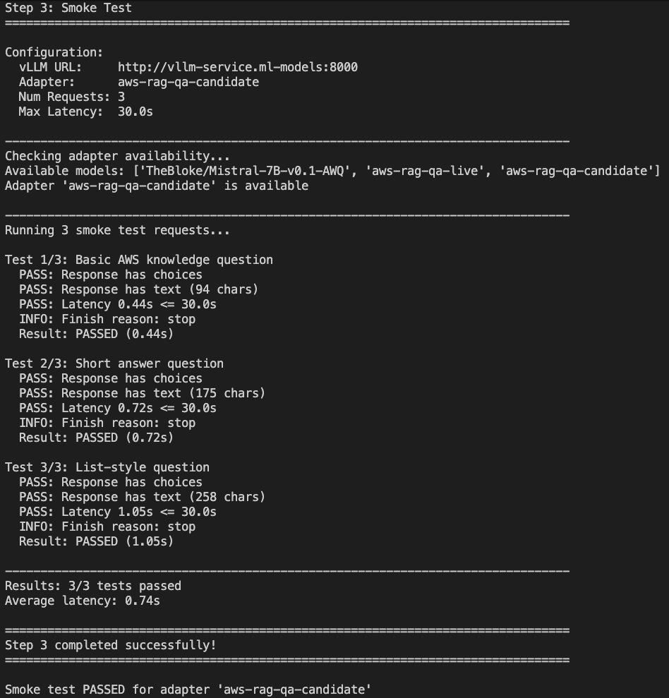

After deployment — version 4 now has both `candidate` and `staged` aliases:

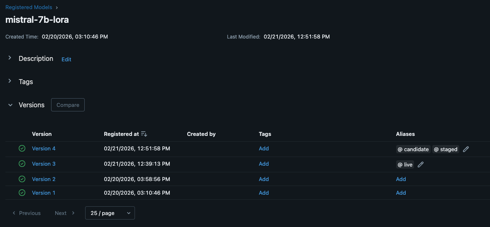

## Evaluation Workflow

**File:** `evaluate-lora-adapter.yaml`

**Purpose:** Offline evaluation of the staged candidate adapter using an LLM-as-Judge. Compares candidate vs live adapter on a fixed eval dataset and decides whether the candidate passes.

**Detailed documentation:** [evaluation/vllm/README.md](../../evaluation/vllm/README.md)

### Steps

| Step | Script | Description |
|------|--------|-------------|
| download-eval-data | `aws s3 cp` | Resolves data version from MLflow, downloads eval.jsonl from S3 |
| inference-candidate | `run_inference.py` | Runs eval samples against candidate adapter (parallel) |
| inference-live | `run_inference.py` | Runs eval samples against live adapter (parallel, optional) |
| judge-answers | `run_judge.py` | Sends all answers to Judge LLM for A/B/C grading |
| compare-decision | `compare_decision.py` | Aggregates scores, runs 3-check decision, logs to MLflow |

### Decision Logic

Three checks must ALL pass:

| Check | Comparative | Absolute (first deploy) |
|-------|-------------|------------------------|
| A-Rate (Judge) | Candidate >= Live | >= 70% |
| C-Rate (Judge) | Candidate <= Live | <= 10% |
| Refusal Rate (deterministic) | Candidate >= 90% AND >= Live | >= 90% |

### Data Flow

The eval data version is resolved from MLflow (not hardcoded). The download step queries the candidate adapter's training run for the `data.version` tag:

```
download-eval-data ──eval.jsonl──> inference-candidate ──results──> judge-answers ──grades──> compare-decision
                                   inference-live ──────results──>                              (MLflow logging)
```

### Parameters

| Parameter | Default | Description |
|-----------|---------|-------------|
| `model-name` | `mistral-7b-lora` | MLflow registered model name |
| `candidate-adapter` | `aws-rag-qa-candidate` | Candidate adapter slot name |
| `live-adapter` | `aws-rag-qa-live` | Live adapter slot name |
| `vllm-url` | `http://vllm-service.ml-models:8000` | vLLM server URL |
| `judge-url` | `http://judge-vllm-service.ml-models:8000` | Judge vLLM URL |
| `judge-model` | `""` (auto-detect) | Judge model name |
| `mlflow-tracking-uri` | `http://mlflow.ai-platform:80` | MLflow URL |
| `s3-data-bucket` | `s3://my-vllm-data` | S3 bucket for eval data |
| `max-concurrent` | `15` | Concurrent requests per step |
| `min-a-rate` | `0.70` | Minimum A-rate threshold |
| `max-c-rate` | `0.10` | Maximum C-rate threshold |
| `min-refusal-rate` | `0.90` | Minimum refusal rate |
| `mlflow-experiment` | `vllm-lora-evaluation` | MLflow experiment name |

### Resource Requirements

| Step | Node | GPU | CPU | Memory |
|------|------|-----|-----|--------|
| download-eval-data | any | - | 250m-500m | 256Mi-512Mi |
| inference-candidate | any | - | 500m-1000m | 512Mi-1Gi |
| inference-live | any | - | 500m-1000m | 512Mi-1Gi |
| judge-answers | any | - | 500m-1000m | 512Mi-1Gi |
| compare-decision | any | - | 250m-500m | 256Mi-512Mi |

### Usage

```bash
# Run evaluation with defaults
argo submit evaluate-lora-adapter.yaml

# Override thresholds
argo submit evaluate-lora-adapter.yaml \
  -p min-a-rate=0.75 \
  -p max-c-rate=0.05

# Different judge URL
argo submit evaluate-lora-adapter.yaml \
  -p judge-url=http://judge-large-vllm:8000
```

### Successful Run (Llama 70B Judge)

Evaluation workflow completed in 52m 39s (download 1m, inference 7-8m parallel, judge 41m, compare 14s):

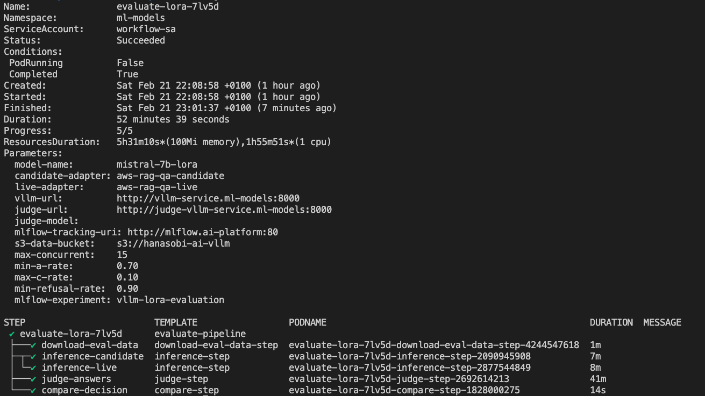

MLflow experiment run — candidate A-Rate 89.6% vs live 88.4%, refusal rate 97.5%:

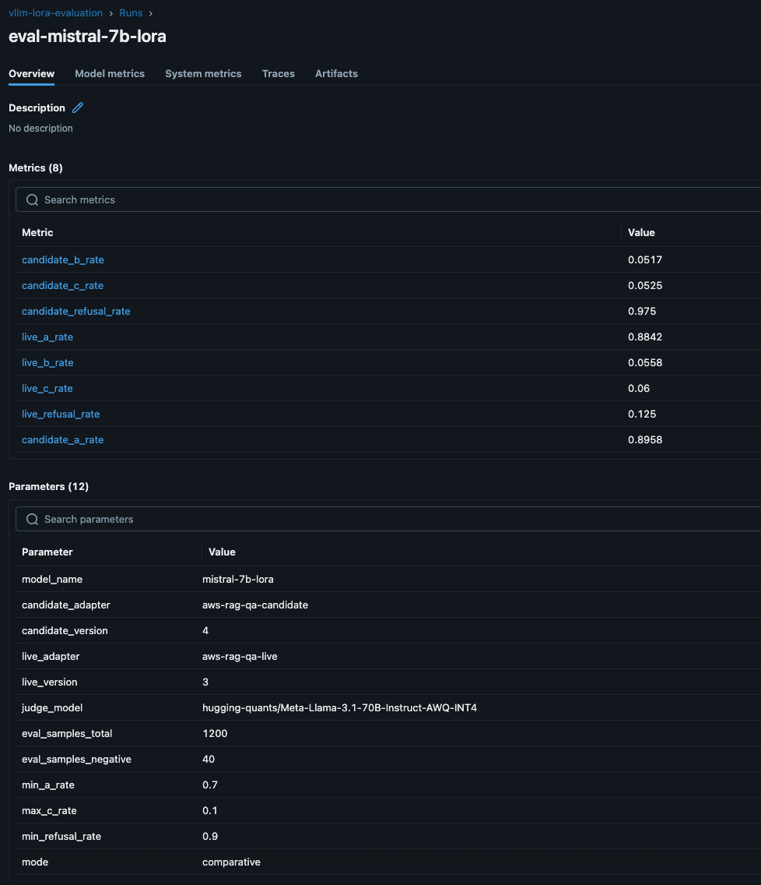

After evaluation — version 4 tagged with `eval-passed`, ready for promotion:

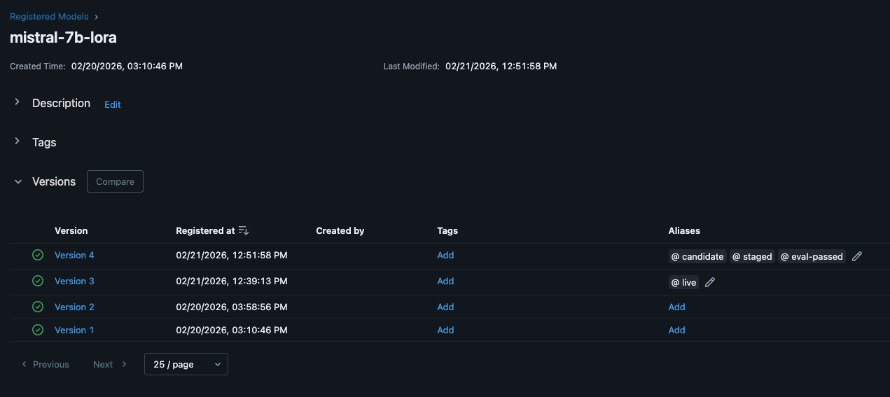

MLflow dataset lineage — eval-v2 (d9a73a27) logged with S3 source URI, content digest, and schema:

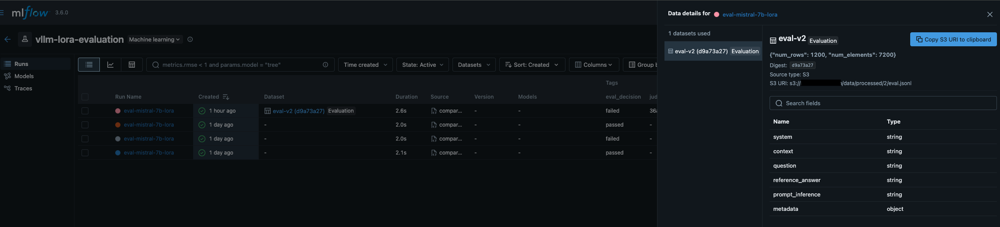

### Failed Run (Mistral-7B Judge)

Same adapters evaluated with Mistral-7B-Instruct as judge — candidate A-Rate 85.9% vs live 87.3% (candidate worse due to weaker hallucination detection):

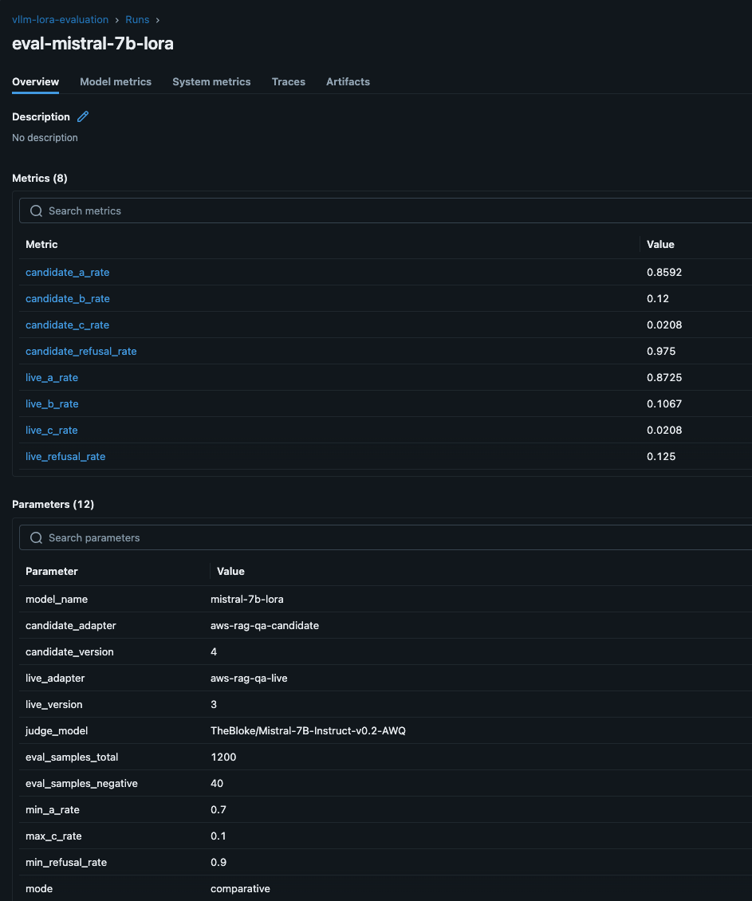

compare-decision exits with code 1, version 4 tagged with `eval-failed`:

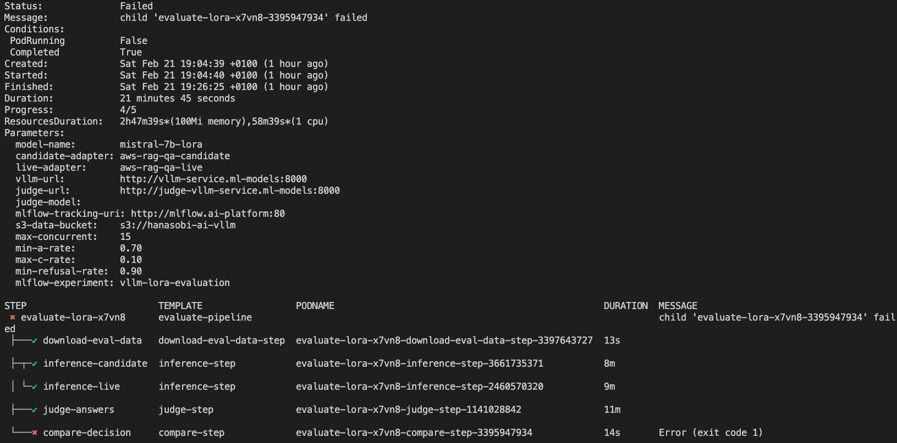

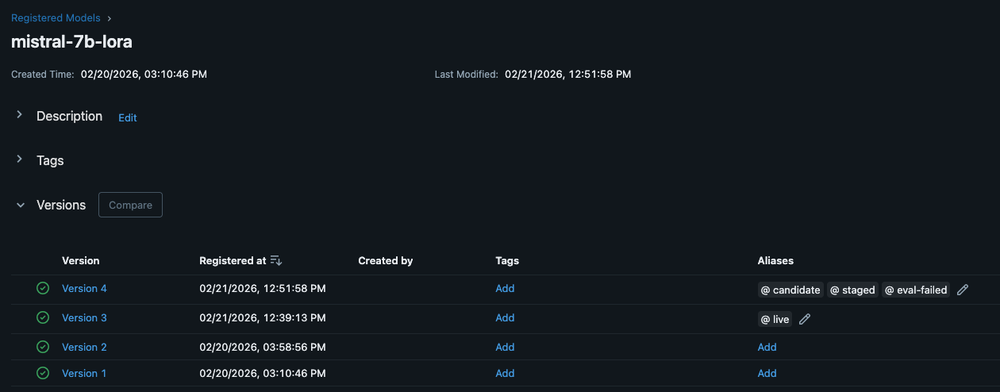

## Performance Workflow (Gate 2)

**File:** `performance-test-lora.yaml`

**Purpose:** Validate adapter performance under concurrent load using server-side Prometheus metrics. Runs after Gate 1 (Evaluation) passes.

**Detailed documentation:** [performance/vllm/README.md](../../performance/vllm/README.md)

### Steps

| Step | Script | Description |
|------|--------|-------------|
| download-eval-data | `aws s3 cp` | Resolves data version from MLflow `eval-passed` alias, downloads eval.jsonl from S3 |
| run-load-test | `run_load_test.py` | Fires concurrent requests (10 parallel), queries Prometheus for server-side metrics |
| perf-decision | `perf_decision.py` | Evaluates metrics against absolute floors + relative baselines, logs to MLflow |

### Decision Logic

Four checks must ALL pass:

| Check | Absolute Floor | Relative (vs. Baseline) |
|-------|----------------|------------------------|
| P95 E2E Latency | < 8.0s | <= baseline * 1.15 |
| P95 TTFT | < 2.0s | <= baseline * 1.15 |
| Throughput | > 2.0 req/s | >= baseline * 0.85 |
| Success Rate | >= 99% | >= baseline |

### Parameters

| Parameter | Default | Description |
|-----------|---------|-------------|
| `model-name` | `mistral-7b-lora` | MLflow registered model name |
| `candidate-adapter` | `aws-rag-qa-candidate` | Candidate adapter slot name |
| `vllm-url` | `http://vllm-service.ml-models:8000` | vLLM server URL |
| `prometheus-url` | `http://monitoring-kube-prometheus-prometheus.ai-platform:9090` | Prometheus URL |
| `mlflow-tracking-uri` | `http://mlflow.ai-platform:80` | MLflow URL |
| `s3-data-bucket` | `s3://my-vllm-data` | S3 bucket for eval data |
| `concurrency` | `10` | Concurrent requests |
| `max-tokens` | `256` | Max tokens per request |
| `max-samples` | `0` | Max samples (0 = all) |
| `max-p95-latency` | `8.0` | P95 latency ceiling (seconds) |
| `max-p95-ttft` | `2.0` | P95 TTFT ceiling (seconds) |
| `min-throughput` | `2.0` | Minimum throughput (req/s) |
| `min-success-rate` | `0.99` | Minimum success rate |
| `latency-regression-factor` | `1.15` | Max latency regression vs baseline |
| `throughput-regression-factor` | `0.85` | Min throughput retention vs baseline |
| `mlflow-experiment` | `vllm-lora-performance` | MLflow experiment name |

### Resource Requirements

| Step | Node | GPU | CPU | Memory |
|------|------|-----|-----|--------|
| download-eval-data | any | - | 250m-500m | 256Mi-512Mi |
| run-load-test | any | - | 500m-1000m | 512Mi-1Gi |
| perf-decision | any | - | 250m-500m | 256Mi-512Mi |

### Usage

```bash
# Run performance test with defaults
argo submit performance-test-lora.yaml

# Override thresholds
argo submit performance-test-lora.yaml \
  -p max-p95-latency=5.0 \
  -p min-throughput=5.0

# Higher concurrency
argo submit performance-test-lora.yaml \
  -p concurrency=20
```

### Successful Run

Performance test completed in 6m 27s (download 15s, load test 5m, decision 14s):

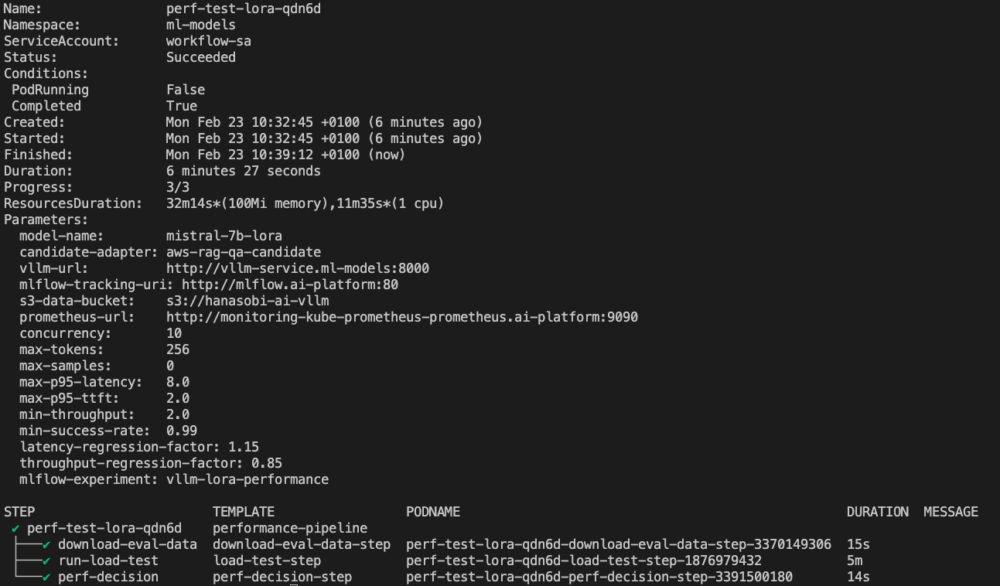

Server-side Prometheus metrics — P95 Latency 4.89s, P95 TTFT 0.50s, Throughput 3.64 req/s:

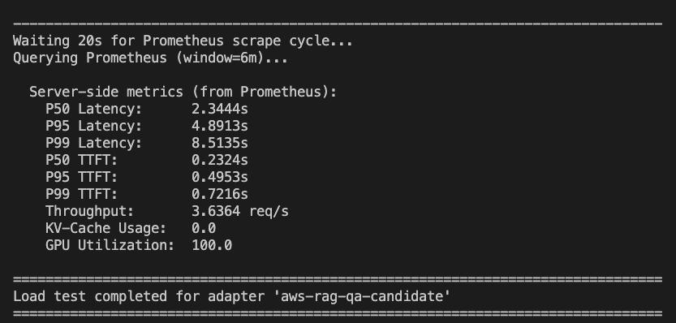

MLflow Model Registry — version 4 with `perf-passed` alias after Gate 2:

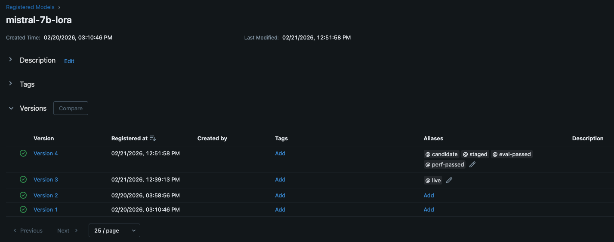

MLflow dataset lineage — same eval-v2 (d9a73a27) tracked across evaluation and performance runs:

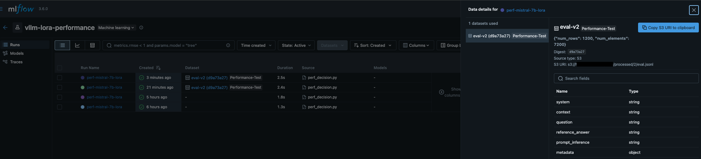

Grafana dashboard during load test — 10 concurrent requests, 100% GPU utilization:

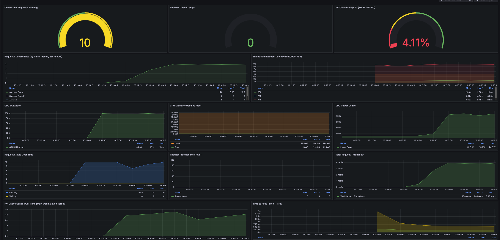

## Promote Workflow

**File:** `promote-lora-adapter.yaml`

**Purpose:** Promote a validated adapter to the live slot. Wraps `promote_adapter.py` with rollback support via the `source-alias` parameter.

### Steps

| Step | Script | Description |
|------|--------|-------------|
| promote-adapter | `promote_adapter.py` | Download from MLflow, copy to live slot, reload via API, update aliases |

### What It Does

1. Resolves adapter version from MLflow alias (`source-alias`)
2. Downloads adapter artifacts from MLflow
3. `kubectl cp` to the live slot (`aws-rag-qa-live`) on the vLLM pod
4. Unloads old live adapter, loads new one via runtime API
5. Updates MLflow aliases: new version → `live`, old live → `previous`
6. Cleans up intermediate aliases (`staged`, `eval-passed`, `perf-passed`, `eval-failed`, `perf-failed`)

### Parameters

| Parameter | Default | Description |
|-----------|---------|-------------|
| `model-name` | `mistral-7b-lora` | MLflow registered model name |
| `source-alias` | `staged` | MLflow alias to promote (use `perf-passed` after full pipeline, `previous` for rollback) |
| `deployment` | `vllm` | Kubernetes deployment name |
| `namespace` | `ml-models` | Kubernetes namespace |
| `vllm-url` | `http://vllm-service.ml-models:8000` | vLLM server URL |
| `mlflow-tracking-uri` | `http://mlflow.ai-platform:80` | MLflow URL |

### Resource Requirements

| Step | Node | GPU | CPU | Memory |
|------|------|-----|-----|--------|
| promote-adapter | any | - | 250m-500m | 256Mi-512Mi |

### Usage

```bash
# Promote after full pipeline (Gate 1 + Gate 2)
argo submit promote-lora-adapter.yaml \
  -p source-alias=perf-passed

# Promote after evaluation only (skip perf gate)
argo submit promote-lora-adapter.yaml \
  -p source-alias=eval-passed

# Rollback to previous version
argo submit promote-lora-adapter.yaml \
  -p source-alias=previous
```

### Successful Run

Promote workflow — adapter copied to live slot, aliases updated, all gate aliases cleaned up:

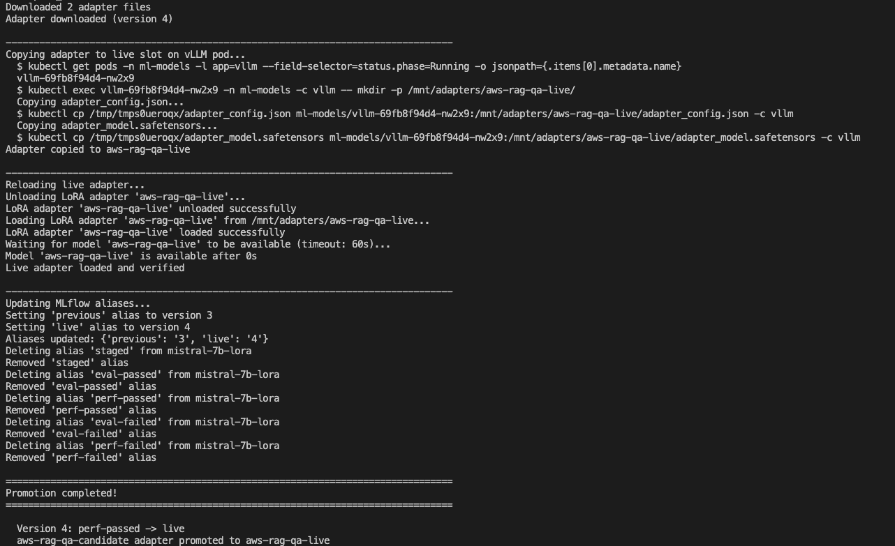

MLflow after promotion — version 4 is `live`, version 3 is `previous`, all intermediate aliases removed:

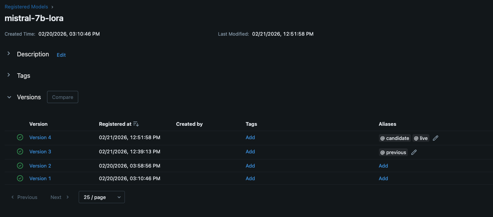

## MLflow Alias Strategy

```
Training       Deployment       Evaluation (Gate 1)    Performance (Gate 2)   Promote
========       ==========       ===================    ====================   =======

train
    |
    v
quality-gate
    |
    v
  candidate ──> load-adapter
                     |
                     v
                 smoke-test
                     |
                     v
             set-staged-alias
                     |
                     v
            cand + staged ──> download-eval-data
                                   |
                                   v
                              inference (parallel)
                                   |
                                   v
                              judge-answers
                                   |
                                   v
                             compare-decision
                               |          |
                               v          v
                          eval-passed  eval-failed
                               |
                               v
                          download-eval-data ──> run-load-test
                                                      |
                                                      v
                                                 perf-decision
                                                   |          |
                                                   v          v
                                              perf-passed  perf-failed
                                                   |
                                                   v
                                              promote-adapter
                                                   |
                                                   v
                                             live ──> (serving traffic)
                                          previous ──> (rollback target)
```

| Alias | Set By | Meaning |
|-------|--------|---------|
| `candidate` | quality_gate.py | Passed training quality gate |
| `staged` | set_staged_alias.py | Deployed to candidate slot, smoke test passed |
| `eval-passed` | compare_decision.py | Passed all 3 evaluation checks (Gate 1) |
| `eval-failed` | compare_decision.py | Failed at least one evaluation check |
| `perf-passed` | perf_decision.py | Passed all 4 performance checks (Gate 2) |
| `perf-failed` | perf_decision.py | Failed at least one performance check |
| `live` | promote_adapter.py | Promoted to live slot, serving production traffic |
| `previous` | promote_adapter.py | Previous live version, rollback target |

## Docker Images

| Image | Used By | Key Dependencies |
|-------|---------|------------------|
| `vllm-training-tools` | Training Workflow | PyTorch, transformers, peft, bitsandbytes, MLflow |
| `vllm-deployment-tools` | Deployment, Evaluation, Performance, and Promote Workflows, Init Container | MLflow, boto3, requests, kubectl |

Both images are built via GitHub Actions and pushed to ECR (`123456789012.dkr.ecr.eu-central-1.amazonaws.com`).

## Prerequisites

- Argo Workflows controller installed in the cluster
- `workflow-sa` ServiceAccount with IRSA for S3 access + RBAC for pods/exec and deployments
- MLflow Tracking Server accessible at the configured URI
- For training: `gpu-training` node group with `nvidia.com/gpu` taint
- For deployment: vLLM running with `VLLM_ALLOW_RUNTIME_LORA_UPDATING=True`
- For evaluation: Judge vLLM instance running (Mistral-7B-Instruct or Llama 70B Instruct)
- For performance: Prometheus with vLLM ServiceMonitor scraping metrics
- HuggingFace token secret (`hf-token`) in the `ml-models` namespace
